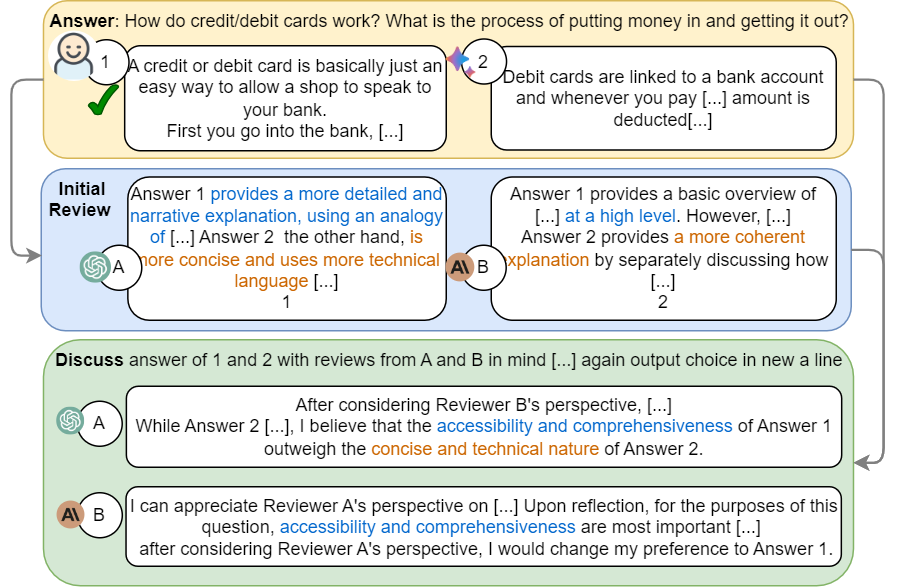

# PRD: Peer Rank and Discussion Improve Large Language Model based Evaluations

| [Paper]() | [Demo](http://bcdnlp.github.io/PR_LLM_EVAL) |

## Peer Rank (PR) process:


## Peer Discussion (PD) process:



## Install Dependencies

```bash
# create an environment
conda create -n prd python=3.8
conda activate prd

# install from the requirement file by pip
pip install -r requirement.txt
```

## Datasets

For information about datasets, please refer to the [README](data/README.md) file.

## Generated Results

For information about generated results, please refer to the [README](results/README.md) file.

## Run

All codes are run in the root folder. Please follow the bash commands to run corresponding parts.

### Peer Rank

(To Be Added)

### Peer Discussion

Before running any python script, please make sure the file `peer_discussion/config.yml` contains correct configurations you need.

#### Reviews Generation

```bash
python peer_discussion/review_lfqa.py
```

There is no codes of generating reviews for Vicuna80 since they are provided in the Peer Rank related codes.

#### Discussion Generation

```bash
# discuss on LFQA
python results/lfqa/gather_all.py
python peer_discussion/discuss_lfqa.py

# discuss on Vicuna80
python results/vicuna80/gather_all.py
python peer_discussion/discuss_vicuna80.py
```

## Citation

Please cite the following if find our work helpful.

```bibtex
(To Be Added)
```

## Contact

Following 2 options are available for any clarification, comments or suggestions

- Create an [issue](https://github.com/bcdnlp/PRD/issues).
- Contact [Ruosen Li](mailto:ruosen.li@utdallas.edu), [Teerth Roshan Patel](mailto:teerth.patel@utdallas.edu), [Xinya Du](mailto:xinya.du@utdallas.edu) by email.

